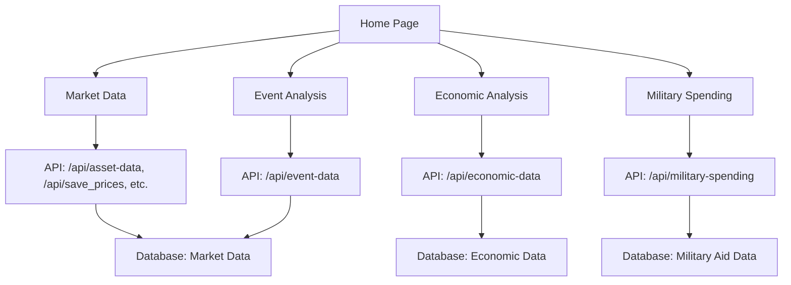

# Market Wizard

Market Wizard is a comprehensive financial analysis platform for market data, events, economic indicators, and global military/aid spending. It provides tools for downloading, visualizing, and analyzing financial and geopolitical data.

## Main Features

- Download and analyze historical market data (stocks, indices, commodities, currencies)
- Event analysis for economic and political events
- Economic indicator tracking (jobs, inflation, GDP, retail sales)
- Military spending and foreign aid tracker (by country, year, and category)
- Modern, responsive UI with advanced analytics

## Main Pages

| Page              | Path                 | Description                               |
| ----------------- | -------------------- | ----------------------------------------- |
| Home              | `/`                  | Dashboard and navigation                  |
| Market Data       | `/market-data`       | Download and analyze market data          |
| Event Analysis    | `/event-analysis`    | Analyze market performance around events  |
| Economic Analysis | `/economic-analysis` | Track and forecast economic indicators    |
| Military Spending | `/military-spending` | Track US military/aid spending by country |

## Table Schemas

### Economic Data Table (`indicator_values`)

| Column    | Type  | Description                |
| --------- | ----- | -------------------------- |
| date      | DATE  | Date of the data point     |
| value     | FLOAT | Value of the indicator     |
| series_id | TEXT  | Economic series identifier |

### Military Aid Data Table (`military_aid_data`)

| Column           | Type    | Description                     |
| ---------------- | ------- | ------------------------------- |
| year             | INTEGER | Calendar year                   |
| country          | TEXT    | Country receiving aid           |
| military_aid     | FLOAT   | Military aid (billions USD)     |
| economic_aid     | FLOAT   | Economic aid (billions USD)     |
| humanitarian_aid | FLOAT   | Humanitarian aid (billions USD) |
| total            | FLOAT   | Total aid (billions USD)        |
| source           | TEXT    | Data source                     |
| notes            | TEXT    | Additional notes (optional)     |

## App Architecture

## How to Update

- Always update this README after pushing new features or pages.
- Add new table schemas and update the architecture diagram as needed.
